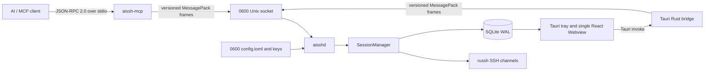

<!--
AI-DOC: Architecture facts derived from the repository on 2026-09-01.
Keep secrets, hostnames, credentials, session IDs, and terminal output out of this file.
-->

# AI SSH Architecture

## System View

## Startup And Initialization

1. The desktop build runs `apps/desktop/scripts/prepare-helpers.mjs`, which builds and bundles `aisshd` and `aissh-mcp`.
2. The Tauri application creates the `~/.aissh` directory layout, installs bundled helpers atomically, and probes the daemon socket.
3. With user approval, the app starts `aisshd`. The legacy `scripts/install-local.sh` path instead installs a LaunchAgent.
4. `aisshd` loads and validates configuration, binds `~/.aissh/run/aisshd.sock`, opens SQLite in WAL mode, marks unfinished sessions interrupted, and starts the idle reaper.
5. Each desktop or MCP operation opens a Unix connection, performs protocol version 3 handshake, sends one request, and reads one response.
6. `aissh-mcp` independently performs the MCP initialize exchange over line-delimited JSON-RPC stdio.
7. On macOS, showing the main Webview switches the application to the regular activation policy so AI SSH appears in the Dock. Closing the window hides it and restores accessory mode while the tray remains available.

## Modules

| Module | Responsibility |
| --- | --- |
| `apps/mcp-server` | MCP lifecycle, 21 tool definitions, argument mapping, compact/full response shaping and the bounded `content[].text` rendering |
| `apps/daemon` | Same-UID Unix socket service, handshake, request dispatch, daemon lifecycle |
| `apps/desktop` | React configuration UI and two-pane session history workspace with an embedded read-only xterm transcript |
| `apps/desktop/src-tauri` | Native tray, dynamic macOS activation policy, helper installation/startup and Tauri-to-daemon bridge |
| `crates/config` | Path discovery, TOML schema, permission and private-key path enforcement |
| `crates/protocol` | Versioned request/response types and bounded MessagePack framing |
| `crates/session` | Session state, exec/PTY concurrency, cancellation, timeout, blocking polls, lazy reconnect, SFTP file operations and live tail |
| `crates/ssh` | `russh` authentication, exec/PTY channels, SFTP subsystem, shell quoting, UTF-8 locale selection and the staged transfer engine |
| `crates/storage` | SQLite schema, history, paging, retention, recording limits and fleet-wide command listings |

## Communication And State

- MCP transport: one JSON object per stdin line; responses are one JSON object per stdout line.
- Local IPC: a 4-byte length followed by at most 8 MiB of MessagePack data.
- Session sequence numbers are session-scoped and monotonically allocated in memory.
- Persisted events and a bounded 4 MiB live overflow buffer are merged during polling.
- Each session carries a `watch` channel bumped after every recorded event, so a polling caller blocks on real progress instead of sleeping client-side.
- File transfer opens a separate SFTP subsystem channel per operation. The connection `Arc` is cloned and the session slot released before a transfer runs, so a large upload cannot block commands or PTY traffic.
- A dropped transport is detected from a channel that ends without an exit status, marks the command `interrupted`, discards the dead handle, and reconnects lazily on the next operation.
- Session status and event reads use the live runtime when present and fall back to SQLite for historical sessions after daemon restart.
- Foreground exec and PTY are mutually exclusive. Background exec channels do not occupy the foreground slot.
- Session and command history is plaintext SQLite data. Credentials remain in plaintext TOML but are not included in public MCP target summaries.

## Design Patterns

- Daemon-owned sessions allow MCP process restarts without intentionally terminating SSH sessions.
- Shared protocol types keep the MCP adapter, daemon, and desktop bridge aligned.
- Error payloads use stable string codes and an explicit retryable flag. The daemon computes `retryable` and the MCP layer forwards it verbatim rather than re-deriving it from a second list.
- A write is staged beside its destination, verified against a remote digest, and only then renamed into place, so a partial transfer can never be observed at the destination path.
- Configuration is replaced atomically through a temporary mode-0600 file.
- The desktop keeps one main Webview. Tray session actions show that window and emit `select-session`; React changes the selected session without creating per-session native windows.

## Packaging And Release

- `crates/ssh` and the rest of the workspace build into two helpers, `aisshd` and `aissh-mcp`, which the desktop app stages into `src-tauri/binaries` and ships as a bundle resource.
- A universal macOS build stages one helper per architecture. The app installs the one matching the machine it runs on, keyed off the target triple compiled into the running slice and the runtime architecture.
- `bundle.icon` is generated from `src-tauri/icons/icon.svg` by `npm run icons`. Tauri derives the window and menu bar tray icon from the first `.png` entry, which is why the 128px file is listed first.
- The release version is declared in `Cargo.toml`, `apps/desktop/package.json` and `apps/desktop/src-tauri/tauri.conf.json`. `scripts/bump-version.sh` is the only writer; the tag workflow and CI both fail when the three disagree.
- A `v*` tag push builds and publishes the unsigned universal app. Pushing with `GITHUB_TOKEN` does not trigger further workflows, so the tag workflow calls the release workflow as a reusable workflow instead of relying on the tag push to do it.

## Updates

- The desktop app depends on `tauri-plugin-updater`. The check is automatic and the install is confirmed, because a menu bar app restarting itself unannounced is worse than being one version behind.
- The update path is Rust-only. The plugin's default permission set grants the frontend the check/download/install commands, and it is deliberately not added to the capability file, so the webview cannot start an install.
- An update archive is accepted only if a minisign signature over its bytes matches the public key in `tauri.conf.json`. That signature is independent of Apple code signing, which is why an unsigned build can still update itself.
- Update checks and their logging are the only network traffic the app originates; the daemon and MCP server never fetch anything.
- The release publishes `latest.json` at a fixed URL under the repository's latest release: `releases/latest/download/latest.json`. Both macOS platform keys point at one universal archive, renamed to a URL-safe asset because a space in an asset name is rewritten by GitHub on some download URLs.

## Authentication And Authorization

Remote authentication supports password and private key credentials. SSH host keys are accepted without verification; the observed SHA256 fingerprint is recorded for display only.

Local authorization is a same-operating-system-user boundary: the socket is mode `0600` and the daemon checks peer UID. There is no per-MCP-client session ownership or capability token. Any process running as the same user can access and control daemon sessions; this is an explicit architectural trust boundary that should be considered when multiple AI clients run under one account.

The file tools extend what the daemon touches rather than what a caller is permitted to reach: `ssh_file_upload` and `ssh_file_download` read and write local paths on the daemon's machine on request, and `ssh_file_write` with `sudo: true` runs a privileged step through `sudo -n`. Both are bounded by what the same user could already do directly, and neither supplies the login password to a prompt.
