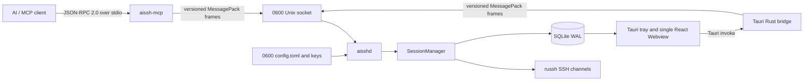

<!--
AI-DOC: Architecture facts derived from the repository on 2026-09-01.
Keep secrets, hostnames, credentials, session IDs, and terminal output out of this file.
-->

# AI SSH Architecture

## System View

## Startup And Initialization

1. The desktop build runs `apps/desktop/scripts/prepare-helpers.mjs`, which builds and bundles `aisshd` and `aissh-mcp`.
2. The Tauri application creates the `~/.aissh` directory layout, installs bundled helpers atomically, and probes the daemon socket.
3. With user approval, the app starts `aisshd`. The legacy `scripts/install-local.sh` path instead installs a LaunchAgent.
4. `aisshd` loads and validates configuration, binds `~/.aissh/run/aisshd.sock`, opens SQLite in WAL mode, marks unfinished sessions interrupted, and starts the idle reaper.
5. Each desktop or MCP operation opens a Unix connection, performs protocol version 2 handshake, sends one request, and reads one response.
6. `aissh-mcp` independently performs the MCP initialize exchange over line-delimited JSON-RPC stdio.
7. On macOS, showing the main Webview switches the application to the regular activation policy so AI SSH appears in the Dock. Closing the window hides it and restores accessory mode while the tray remains available.

## Modules

| Module | Responsibility |
| --- | --- |
| `apps/mcp-server` | MCP lifecycle, 14 tool definitions, argument mapping, public JSON/text event encoding |
| `apps/daemon` | Same-UID Unix socket service, handshake, request dispatch, daemon lifecycle |
| `apps/desktop` | React configuration UI and two-pane session history workspace with an embedded read-only xterm transcript |
| `apps/desktop/src-tauri` | Native tray, dynamic macOS activation policy, helper installation/startup and Tauri-to-daemon bridge |
| `crates/config` | Path discovery, TOML schema, permission and private-key path enforcement |
| `crates/protocol` | Versioned request/response types and bounded MessagePack framing |
| `crates/session` | Session state, exec/PTY concurrency, cancellation, timeout, polling and live tail |
| `crates/ssh` | `russh` authentication, channel operations, shell quoting and UTF-8 locale selection |
| `crates/storage` | SQLite schema, history, paging, retention and recording limits |

## Communication And State

- MCP transport: one JSON object per stdin line; responses are one JSON object per stdout line.
- Local IPC: a 4-byte length followed by at most 8 MiB of MessagePack data.
- Session sequence numbers are session-scoped and monotonically allocated in memory.
- Persisted events and a bounded 4 MiB live overflow buffer are merged during polling.
- Session status and event reads use the live runtime when present and fall back to SQLite for historical sessions after daemon restart.
- Foreground exec and PTY are mutually exclusive. Background exec channels do not occupy the foreground slot.
- Session and command history is plaintext SQLite data. Credentials remain in plaintext TOML but are not included in public MCP target summaries.

## Design Patterns

- Daemon-owned sessions allow MCP process restarts without intentionally terminating SSH sessions.
- Shared protocol types keep the MCP adapter, daemon, and desktop bridge aligned.
- Error payloads use stable string codes and an explicit retryable flag.
- Configuration is replaced atomically through a temporary mode-0600 file.
- The desktop keeps one main Webview. Tray session actions show that window and emit `select-session`; React changes the selected session without creating per-session native windows.

## Authentication And Authorization

Remote authentication supports password and private key credentials. SSH host keys are accepted without verification; the observed SHA256 fingerprint is recorded for display only.

Local authorization is a same-operating-system-user boundary: the socket is mode `0600` and the daemon checks peer UID. There is no per-MCP-client session ownership or capability token. Any process running as the same user can access and control daemon sessions; this is an explicit architectural trust boundary that should be considered when multiple AI clients run under one account.
